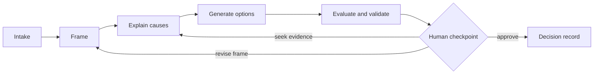

# FrameShift

FrameShift is an open-source, interactive reasoning system for finding the right problem before optimizing a solution.

Engineering requests often arrive as solutions in disguise: “select a 5 kW DC/DC,” “change the motor,” or “add a battery.” FrameShift moves deliberately between component, subsystem, product, operational, and business levels; makes assumptions and evidence explicit; builds inspectable causal models; explores alternatives; and records why a decision was made.

> **Status:** specification-first, pre-alpha. This repository defines the product, contracts, architecture, portability layer, and implementation backlog. It does not yet contain a production application.

## Product promise

FrameShift helps a person or team:

1. distinguish an observation, need, requirement, constraint, assumption, and proposed solution;
2. reframe the problem at useful abstraction levels and system boundaries;
3. build causal hypotheses with evidence, confidence, and counter-evidence;
4. generate structurally different options rather than variants of the first idea;
5. compare options against explicit outcomes, constraints, risks, and uncertainty;
6. pause at consequential checkpoints for human judgment; and
7. resume the same reasoning trace across different LLMs and agent runtimes.

## Core loop



## Repository map

| Area | Purpose |
|---|---|
| [`docs/product`](docs/product) | Vision, PRD, scope, and roadmap |
| [`docs/architecture`](docs/architecture) | System, data, graph, memory, security, and testing design |
| [`docs/reasoning`](docs/reasoning) | End-to-end workflow and the four reasoning engines |
| [`docs/interaction`](docs/interaction) | Human-in-the-loop policy and interaction states |
| [`docs/contracts`](docs/contracts) | API and event contracts |
| [`docs/adr`](docs/adr) | Architecture decision records |
| [`specs`](specs) | Runtime portability, prompts, tools, and deterministic checkpoints |
| [`schemas`](schemas) | Model-agnostic JSON Schemas |
| [`adapters`](adapters) | Codex, Claude Code, and generic runtime bootstraps |
| [`evals`](evals) | Portable evaluation harness and fixtures |
| [`backlog`](backlog) | Source-controlled, prioritized issue catalog |

## Quick validation

Requires Python 3.11+ and no third-party packages.

```sh
python scripts/validate_repo.py
python evals/run.py
```

The first implementation milestone is a vertical slice that accepts an intake, produces a framing ladder, asks for human approval, and writes a portable checkpoint. See the [roadmap](docs/product/roadmap.md) and [issue backlog](backlog/issues.yaml).

## Runtime portability

The canonical state is JSON, never provider-specific chat history. Every engine consumes and emits versioned contracts, tools are discovered through a capability manifest, and checkpoints include normalized outputs plus hashes. See the [LLM runtime portability specification](specs/runtime-portability.md).

## Contributing and governance

Read [CONTRIBUTING.md](CONTRIBUTING.md), [SECURITY.md](SECURITY.md), and the [Code of Conduct](CODE_OF_CONDUCT.md). Architectural changes require an ADR. Security reports must not be filed as public issues.

## License

Licensed under the [Apache License 2.0](LICENSE).
