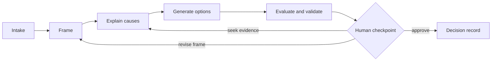

# FrameShift

FrameShift is an open-source, interactive reasoning system for finding the right problem before optimizing a solution.

Engineering requests often arrive as solutions in disguise: “select a 5 kW DC/DC,” “change the motor,” or “add a battery.” FrameShift moves deliberately between component, subsystem, product, operational, and business levels; makes assumptions and evidence explicit; builds inspectable causal models; explores alternatives; and records why a decision was made.

> **Status:** specification-first, pre-alpha. The product specification, contracts, and implementation backlog live in the [issue tracker](https://github.com/tinix84/frameshift/issues). This repository holds the durable decisions, the domain language, and the machine-checkable contracts. It does not yet contain a production application.

## Product promise

FrameShift helps a person or team:

1. distinguish an observation, need, requirement, constraint, assumption, and proposed solution;
2. reframe the problem at useful abstraction levels and system boundaries;
3. build causal hypotheses with evidence, confidence, and counter-evidence;
4. generate structurally different options rather than variants of the first idea;
5. compare options against explicit outcomes, constraints, risks, and uncertainty;
6. pause at consequential checkpoints for human judgment; and
7. resume the same reasoning trace across different LLMs and agent runtimes.

## Core loop



## Principles

1. **Frame before solving.** Identify whether the input is a problem, function, requirement, constraint, assumption, or proposed solution.
2. **Move across boundaries.** Ask “why” to move toward outcomes and “how” to move toward mechanisms.
3. **Separate fact from interpretation.** Claims, evidence, assumptions, and uncertainty are first-class.
4. **Prefer plural hypotheses and options.** Avoid single-chain root-cause theater and first-solution anchoring.
5. **Keep the human accountable.** The tool structures judgment; it does not launder model output into authority.
6. **Make reasoning portable.** A session survives a change of model, provider, interface, or agent runtime.
7. **Earn complexity.** The first useful product is a narrow vertical slice, not a universal ontology.

## Non-goals

- Autonomous approval or execution of consequential engineering decisions.
- Replacing simulation, domain analysis, experiments, certification, or expert review.
- Capturing or exposing private model chain-of-thought — never requested, never stored.
- Guaranteeing root cause, optimality, correctness, or completeness.
- Building a general-purpose project manager or note-taking system.

## Where things are written

Each kind of statement has exactly one home. Nothing is stated twice.

| Statement | Home |
|---|---|
| What a word means | [`CONTEXT.md`](CONTEXT.md) |
| Why we chose X over Y | [`docs/adr`](docs/adr), indexed in [`CLAUDE.md`](CLAUDE.md) |
| What to build, and the contracts it must meet | [GitHub issues](https://github.com/tinix84/frameshift/issues) |
| Status of anything | GitHub issues and milestones `M0`–`M4` |
| The machine-checkable shape of state | [`schemas`](schemas) |
| How a runtime is bootstrapped | [`adapters`](adapters) |
| Versioned prompt text | [`prompts`](prompts) |
| Portable evaluation harness and fixtures | [`evals`](evals) |

Start with the specification issues: [#23 product requirements](https://github.com/tinix84/frameshift/issues/23), [#19 runtime portability](https://github.com/tinix84/frameshift/issues/19), [#20 prompt contracts](https://github.com/tinix84/frameshift/issues/20), [#21 tool capability abstraction](https://github.com/tinix84/frameshift/issues/21), [#22 deterministic checkpoints](https://github.com/tinix84/frameshift/issues/22), and [#24 API and event contracts](https://github.com/tinix84/frameshift/issues/24).

## Quick validation

Requires Python 3.11+ and no third-party packages.

```sh
python scripts/validate_repo.py
python evals/run.py
```

The first implementation milestone is a vertical slice that accepts an intake, produces a framing ladder, asks for human approval, and writes a portable checkpoint — milestone [`M1`](https://github.com/tinix84/frameshift/milestone/2).

## Runtime portability

The canonical state is JSON, never provider-specific chat history. Every engine consumes and emits versioned contracts, tools are discovered through a capability manifest, and checkpoints include normalized outputs plus hashes.

## Contributing and governance

Read [CONTRIBUTING.md](CONTRIBUTING.md), [SECURITY.md](SECURITY.md), and the [Code of Conduct](CODE_OF_CONDUCT.md). Architectural changes require an ADR. Security reports must not be filed as public issues.

## License

Licensed under the [Apache License 2.0](LICENSE).
