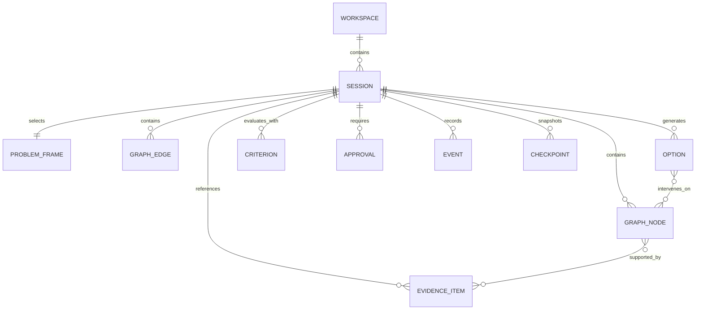

# Data model

## Design goals

- Preserve the user's reasoning state independently of any transcript.
- Keep fact, evidence, inference, assumption, proposal, and approval distinguishable.
- Support revision, conflict, provenance, and deterministic serialization.
- Keep a small stable core with typed extension fields.

## Aggregate model

## Core entities

### Workspace

Tenant and policy boundary: membership, roles, data classification, retention, model policy, tool policy, and encryption context.

### Session

Reasoning aggregate with `id`, `workspace_id`, `title`, `status`, `phase`, `revision`, `active_frame_id`, timestamps, actor references, and extensions.

### Statement

A user or system-authored unit classified as one of `observation`, `need`, `outcome`, `problem`, `function`, `requirement`, `constraint`, `assumption`, `proposal`, or `question`. Classification includes source, author, confidence band, and human confirmation state.

### ProblemFrame

Defines desired outcome, current/desired state, affected stakeholders, abstraction level, system boundary, scope, exclusions, success measures, constraints, assumptions, and open questions. Candidate frames can coexist; exactly one may be `working` after explicit approval.

### GraphNode and GraphEdge

Nodes express outcomes, observations, factors, mechanisms, hypotheses, evidence, assumptions, constraints, interventions, risks, or decisions. Edges express relationships such as `causes`, `contributes_to`, `enables`, `constrains`, `supports`, `contradicts`, `mitigates`, or `tests`. See `graph-model.md`.

### EvidenceItem

Stores a bounded excerpt or artifact reference, source URI, source type, retrieval time, content digest, author/publisher when known, applicability, quality assessment, and access policy. It does not store executable instructions as trusted commands.

### Option

Candidate intervention with frame linkage, leverage level, mechanism, prerequisites, affected graph nodes, estimated outcomes, risks, reversibility, cost/effort bands, evidence, and lifecycle status.

### Criterion and Assessment

Criteria are human-owned definitions with direction, unit, weight/rank, threshold, and uncertainty treatment. Assessments link an option and criterion to a value or band, evidence, method, confidence, and notes. A score is derived, never a fact.

### Approval

Explicit human disposition of a proposal: `approved`, `edited`, `rejected`, `deferred`, or `evidence_requested`. It records target revision/digest, actor, role, time, rationale, and any conditions.

### Event and Checkpoint

Events are immutable domain facts. Checkpoints contain a normalized state snapshot, event cursor, engine/prompt versions, execution metadata, and integrity digests.

## Identity and versioning

- IDs are opaque strings; UUIDv7 is recommended for sortable creation order.
- Every mutable aggregate has an integer revision for optimistic concurrency.
- Schemas use semantic `schema_version` values.
- Content digests use SHA-256 over JSON Canonicalization Scheme-compatible serialization.
- Timestamps are RFC 3339 UTC and excluded from semantic equality where specified.

## Confidence

Use ordinal bands (`unknown`, `low`, `medium`, `high`) rather than pseudo-precise probabilities unless a calibrated quantitative method supplies them. Confidence always names its basis and owner.

## Extensions

Objects may include `extensions` keyed by reverse-domain or adapter namespace. Extensions cannot change canonical transition semantics, approval state, or integrity fields.
