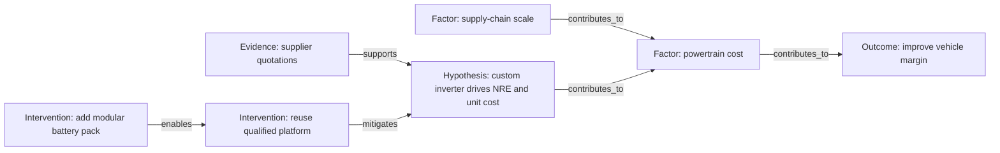

# Mermaid and reasoning graph model

## Purpose

The canonical graph is typed JSON. Mermaid is a deterministic view for people and documentation, not the source of truth.

## Node types

| Type | Meaning | Example |
|---|---|---|
| `outcome` | Desired end result | Improve vehicle contribution margin |
| `observation` | Reported or measured condition | Range shortfall in cold weather |
| `factor` | Potential influence | Battery cell price |
| `mechanism` | How one condition changes another | Higher resistance increases losses |
| `hypothesis` | Testable explanation | Thermal limits force derating |
| `evidence` | Source-backed support or contradiction | Dynamometer test result |
| `assumption` | Unverified premise | Pack envelope cannot change |
| `constraint` | Hard boundary | Homologation deadline |
| `intervention` | Candidate change | Existing platform plus auxiliary pack |
| `risk` | Possible adverse event | Supplier qualification delay |
| `decision` | Approved selection | Adopt platform strategy |

## Edge types

`causes`, `contributes_to`, `correlates_with`, `enables`, `constrains`, `requires`, `supports`, `contradicts`, `tests`, `mitigates`, `worsens`, `addresses`, and `derived_from`.

`causes` is reserved for a supported causal assertion. Early hypotheses should use `contributes_to` or a hypothesis node until evidence supports stronger language.

## Invariants

- Node and edge IDs are unique within a session.
- Edge endpoints exist and cannot reference deleted nodes.
- Self-loops require an explicit `feedback_loop` flag.
- Every evidence relationship points to an `evidence` node or evidence item.
- Every causal edge states confidence band, status, provenance, and owner.
- Cycles are allowed and rendered as feedback, not rejected as errors.
- Contradiction is represented explicitly; it does not delete the contradicted claim.

## Canonical example

## Rendering rules

1. Sort nodes by type then ID; sort edges by source, target, and type.
2. Escape labels and cap visible text at 80 characters; expose full text in detail views.
3. Use shape/color only as redundant cues; labels must carry meaning for accessibility.
4. Show uncertainty and status using edge labels or adjacent badges.
5. Collapse evidence and provenance by default on large graphs.
6. Never parse arbitrary Mermaid text into trusted canonical state without sanitization and validation.

## Views

- **Abstraction ladder:** parent/child relationships between frames.
- **Causal hypothesis:** outcomes, factors, mechanisms, evidence, contradiction.
- **Intervention map:** options linked to leverage points and risks.
- **Decision trace:** selected option, criteria, approvals, and validation plan.
