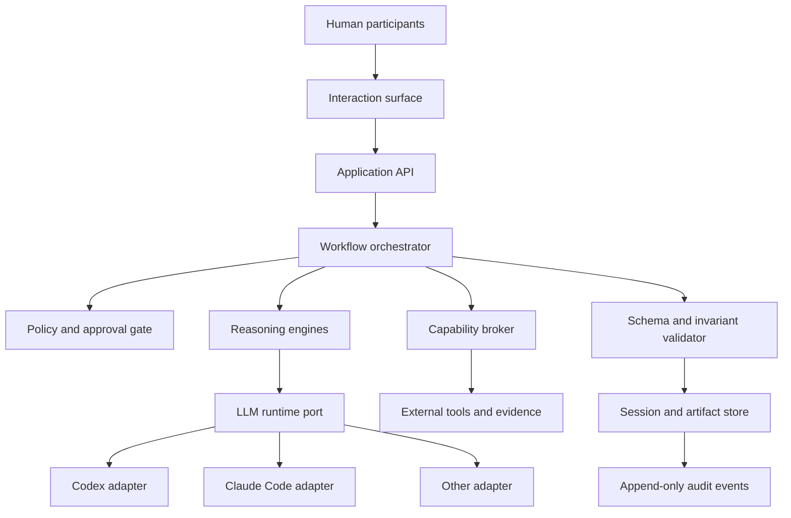
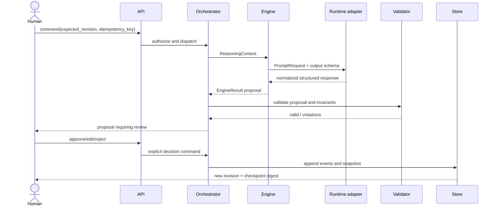

# System architecture

## Context

FrameShift separates durable reasoning state from probabilistic generation. The orchestration core controls workflow, policy, validation, and persistence. LLMs propose typed deltas; they do not own session state or authorization.

## Components

### Interaction surface

Renders the graph, ladder, evidence, option comparison, and checkpoints. It never infers approval from inactivity or conversational tone. Every approval is an explicit domain command.

### Application API

Accepts commands with workspace, session, actor, idempotency key, expected revision, and payload. It streams proposals and returns committed state separately.

### Workflow orchestrator

Implements the state machine, selects the next engine, enforces transition preconditions, and commits validated deltas. It is deterministic for a given command, current revision, selected engine result, and policy configuration.

### Reasoning engines

Four bounded engines produce proposals:

- problem framing;
- causal reasoning;
- solution generation; and
- decision and validation.

Each receives a `ReasoningContext` and returns an `EngineResult`. Engines cannot persist or invoke ungranted tools directly.

### LLM runtime port and adapters

The port accepts a prompt contract, normalized messages/artifacts, output schema, sampling budget, and capability set. Adapters translate this request to Codex, Claude Code, or another runtime and normalize the response. Provider-specific metadata remains in the execution envelope, not the domain model.

### Capability broker

Discovers tools, checks policy and human authorization, validates inputs/outputs, executes with least privilege, and writes provenance. Tool output is untrusted evidence.

### Validators

JSON Schema checks structure. Domain invariants check graph referential integrity, approval transitions, evidence provenance, constraint semantics, and deterministic checkpoint hashes.

### Persistence

The logical model uses event history plus periodic snapshots. Blob artifacts are content-addressed. An implementation may begin with local files and later use a relational database plus object storage without changing contracts.

## Control flow

## Deployment evolution

1. **Reference mode:** local JSON artifacts, in-process orchestrator, runtime adapter invoked by an agent environment.
2. **Single-user application:** local database, sandboxed tools, desktop/web UI.
3. **Collaborative service:** stateless API workers, relational event store, object storage, queue-backed executions, tenant-scoped key management, and policy service.

The boundaries are logical, not a mandate for microservices.
