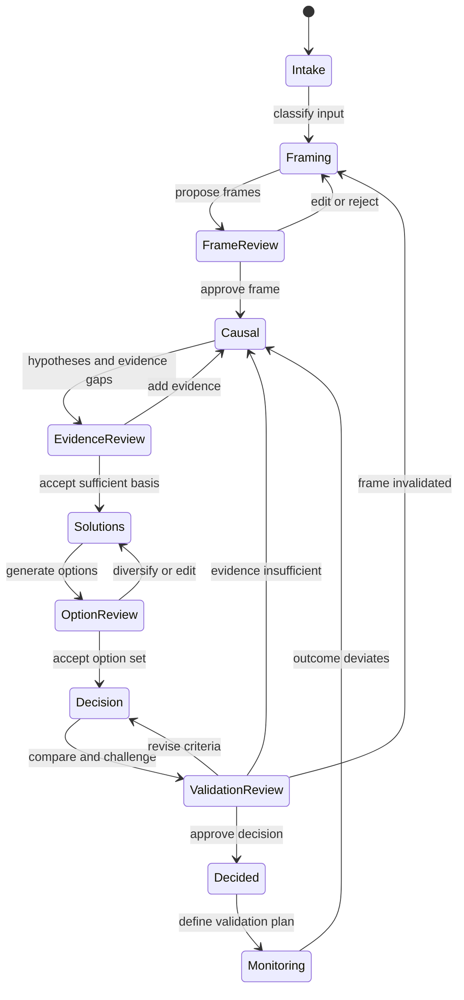

# Reasoning workflows

## State machine

## Common engine protocol

Every engine follows:

1. **Orient:** read approved state, current phase, open questions, capabilities, and policy.
2. **Propose:** return typed deltas, rationale summaries, uncertainty, conflicts, and requested evidence/tools.
3. **Validate:** schema and domain invariant checks run outside the model.
4. **Review:** a human edits, approves, rejects, defers, or requests evidence.
5. **Commit:** accepted deltas become events and a checkpoint may be written.

## Reframing triggers

Loop to framing when:

- the input prescribes a component or implementation without an outcome;
- the success measure changes;
- evidence shows the chosen boundary excludes a dominant driver;
- all options violate a shared constraint;
- local optimization harms the system outcome;
- stakeholders disagree on the actual objective; or
- decision sensitivity is dominated by one unverified assumption.

## Evidence workflow

For each material causal or option claim, label current basis as `observed`, `sourced`, `inferred`, `assumed`, or `unknown`. Define what observation would discriminate competing hypotheses, then request only evidence with likely decision value. Tool retrieval never changes approval state automatically.

## Failure handling

- Invalid model output: one structured repair attempt, then surface validation errors.
- Unavailable capability: propose a manual evidence request or narrower action.
- Stale revision: reject commit and ask the actor to reconcile.
- Conflicting human approvals: preserve both and require authorized resolution.
- Model disagreement: represent alternatives; do not majority-vote into truth.
- Insufficient evidence: allow a conditional decision with explicit validation plan or return to evidence review.
