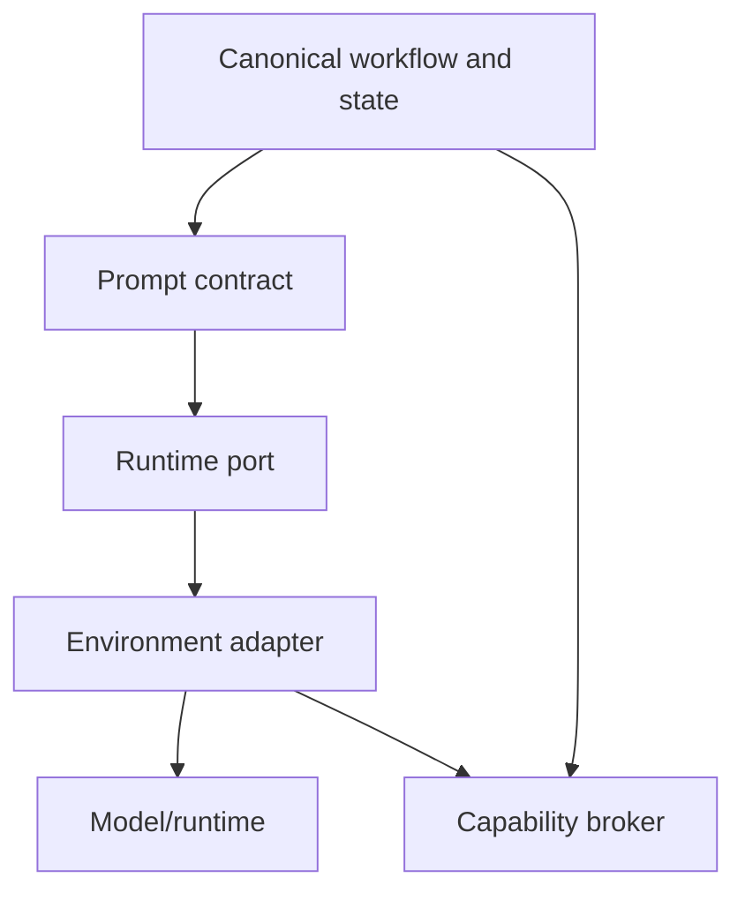

# LLM runtime portability specification

## Goal

Run the same FrameShift workflow consistently in Codex, Claude Code, and other agentic environments without pretending the models or tools are identical.

Consistency means identical canonical contracts, safety invariants, checkpoint semantics, and evaluation criteria—not identical prose or hidden reasoning.

## Layers

## Canonical execution request

The orchestrator provides:

- engine and version;
- prompt contract ID/version;
- bounded `ReasoningContext` artifact references;
- JSON output schema and invariant list;
- capability profile;
- model policy and data classification;
- token/time/tool budgets;
- deterministic execution ID and input-state digest; and
- checkpoint policy.

The adapter returns an `EngineResult` plus an execution envelope containing runtime/model identifiers, adapter version, token/latency metrics when available, stop reason, tool trace digests, raw-response digest, validation/repair count, and warnings.

## Adapter responsibilities

1. Load repo instructions and environment bootstrap.
2. Discover actual capabilities; never assume shell, network, browser, or connectors.
3. Translate canonical requests into runtime-native messages/tools.
4. Delimit untrusted content and preserve source IDs.
5. Request schema-constrained output when supported; otherwise extract and validate JSON.
6. Perform at most one deterministic repair request for structural invalidity.
7. Normalize output without adding domain facts.
8. Never commit proposals or bypass a human checkpoint.
9. Return unsupported capabilities and limitations explicitly.

## Portability profiles

- `conversation-only`: no tools or filesystem; user transfers checkpoints.
- `local-agent`: scoped filesystem and process tools.
- `connected-agent`: local tools plus authenticated connectors.
- `service-runtime`: API-hosted model and broker-managed tools.

Workflows declare required and optional capabilities. Missing required capabilities block with a typed error; missing optional capabilities produce alternatives.

## Prompt packaging

Prompts are referenced by immutable IDs, divided into role, task, input mapping, output schema, invariants, and failure behavior. Environment bootstraps may add operational instructions but cannot change canonical semantics. See `prompt-contracts.md`.

## State transfer

Only a checkpoint is portable. Provider chat history, caches, internal memory, and hidden reasoning are explicitly non-portable. Restore verifies integrity, schema support, policy compatibility, and capability gaps before execution.

## Determinism boundary

LLM generation is nondeterministic. Deterministic behavior covers canonical serialization, IDs derived where specified, validation, state transitions, proposal/approval separation, checkpoint digests, and evaluation scoring. Model seeds are recorded when supported but are not relied upon.

## Conformance

An adapter is conformant when it:

- maps its capabilities to the canonical manifest;
- passes schema and invalid-output repair fixtures;
- preserves source/provenance IDs;
- respects approval and tool policy fixtures;
- round-trips the reference checkpoint;
- emits required execution metadata; and
- reports deviations for unsupported runtime behavior.

## Supported bootstrap files

- Root `AGENTS.md`: canonical repository instructions.
- `CLAUDE.md`: Claude Code entrypoint.
- `.github/copilot-instructions.md`: Copilot context.
- `adapters/codex/bootstrap.md`: Codex operational mapping.
- `adapters/claude-code/bootstrap.md`: Claude Code operational mapping.
- `adapters/generic/bootstrap.md`: minimum generic mapping.

Bootstrap files are conveniences. Schemas and workflow invariants remain authoritative.
